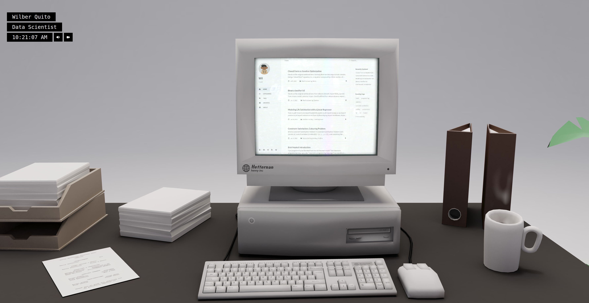

# wilberquito-portfolio.onrender.com



This is one of two repositories created for my portfolio website
<a href="https://wilberquito-portfolio.onrender.com"><samp>wilberquito-portfolio.onrender.com</samp></a>.
If you are looking for the 2D repository you can find it on <a href="https://github.com/wilberquito/wilberquito.github.io"><samp>wilberquito.github.com</samp></a>!

Thanks for taking the time to check this out. If you have any questions of comments, feel free to shoot me an email at <samp><a href="mailto:toname@gmail.com">typingwil@gmail.com</a></samp> or you can *DM* me on any social media as <samp><a href="">wilberquito</a></samp>.<br>

To setup a dev environment:

```bash
# Clone the repository

# Install dependencies
npm i

# Run the local dev server
npm run dev
```

To serve a production build:

```bash
# Install dependencies if not already done - 'npm i'

# Build for production
npm run build

# Serve the build using express
npm start
```
